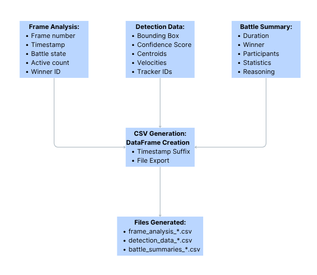

# Beyblade Battle Analyzer

A sophisticated AI-powered system for analyzing Beyblade battles using computer vision and machine learning. This project leverages YOLO object detection to track Beyblades in real-time and provides comprehensive battle analytics.

## 🎯 Features

- **Real-time Beyblade Detection**: Custom-trained YOLO model for accurate Beyblade detection
- **Battle Analysis**: Advanced algorithms to track movement patterns, spinning states, and battle outcomes
- **Arena Bounds Selection**: Interactive tool to define battle arena boundaries
- **Comprehensive Statistics**: Detailed battle summaries including winner determination and performance metrics
- **Video Processing**: Annotated video output with real-time battle visualization
- **Data Export**: CSV and JSON export capabilities for further analysis
- **Multiple Model Sizes**: Support for nano, small, and medium YOLO models

## 🛠️ Architecture

The project follows a modular pipeline architecture:

```
┌─────────────────┐    ┌──────────────────┐    ┌─────────────────┐
│ Data Ingestion  │───▶│ Model Training   │───▶│ Video Analysis  │
└─────────────────┘    └──────────────────┘    └─────────────────┘
                                                        │
                                                        ▼
┌─────────────────┐    ┌──────────────────┐    ┌─────────────────┐
│ Battle Summary  │◀───│ Arena Selection  │◀───│ Frame Processing│
└─────────────────┘    └──────────────────┘    └─────────────────┘
```

## 📁 Project Structure

```
beyblade_battle_analyzer/
├── main.py                     # Main entry point
├── requirements.txt             # Python dependencies
├── config/
│   └── config.yaml             # Configuration settings
├── src/beyblade_battle_analyzer/
│   ├── components/             # Core components
│   │   ├── data_ingestion.py   # Dataset download from Roboflow
│   │   ├── model_training.py   # YOLO model training
│   │   ├── beyblade_detector.py # Object detection
│   │   ├── battle_analyzer.py  # Battle logic and tracking
│   │   ├── video_processor.py  # Video processing
│   │   ├── battle_summary.py   # Battle result analysis
│   │   └── data_manager.py     # Data export and management
│   ├── pipelines/              # Processing pipelines
│   ├── config/                 # Configuration management
│   ├── entity/                 # Data classes and entities
│   └── utils/                  # Utility functions
├── artifacts/                  # Generated outputs
│   ├── training/               # Model weights and training data
│   ├── video_processor/        # Processed videos and results
│   └── input_video/           # Input video files
└── logs/                      # Application logs
```

## 🚀 Installation

1. **Clone the repository**:
   ```bash
   git clone <repository-url>
   cd beyblade_battle_analyzer
   ```

2. **Install dependencies**:
   ```bash
   pip install -r requirements.txt
   ```

3. **Set up configuration**:
   - Edit `config/config.yaml` to set your Roboflow API key
   - Adjust paths and parameters as needed

## 📋 Requirements

- Python 3.8+
- OpenCV
- PyTorch
- Ultralytics YOLO
- Roboflow
- Pandas
- NumPy

See `requirements.txt` for complete dependency list.

## 🎮 Usage

### Training Pipeline

Train a custom YOLO model on Beyblade data:

```bash
python main.py --pipeline training
```

This will:
1. Download the dataset from Roboflow
2. Train a YOLO model (nano/small/medium versions available)
3. Save trained weights to `artifacts/training/`

### Video Analysis Pipeline

Analyze Beyblade battles in video:

```bash
python main.py --pipeline video_analyzer
```

This will:
1. Launch arena bounds selector (interactive)
2. Process video with trained model
3. Generate battle analysis and statistics
4. Export results to CSV/JSON
5. Create annotated video output

### Device Configuration

Both training and inference support GPU/CPU device selection:

```bash
# Use automatic device selection (default)
python main.py --pipeline training --device auto

# Force CPU usage
python main.py --pipeline training --device cpu

# Use CUDA GPU (if available)
python main.py --pipeline training --device cuda

# Use specific GPU
python main.py --pipeline training --device cuda:0
python main.py --pipeline video_analyzer --device cuda:1
```

Device options:
- `auto`: Automatically select best available device (GPU if available, otherwise CPU)
- `cpu`: Force CPU usage
- `cuda`: Use default CUDA GPU
- `cuda:0`, `cuda:1`, etc.: Use specific GPU device

## ⚙️ Configuration

Key configuration options in `config/config.yaml`:

### Device Configuration

The system supports flexible device selection for both training and inference:

#### Configuration File
Set the default device in `config/config.yaml`:
```yaml
model_training:
  device: auto    # Options: auto, cpu, cuda, cuda:0, cuda:1, etc.

beyblade_detector:
  device: auto    # Options: auto, cpu, cuda, cuda:0, cuda:1, etc.
```

#### Command Line Override
Override device settings at runtime:
```bash
# Use automatic device selection
python main.py --pipeline training --device auto

# Force CPU usage (useful for debugging or CPU-only systems)
python main.py --pipeline training --device cpu

# Use CUDA GPU if available
python main.py --pipeline video_analyzer --device cuda

# Use specific GPU device
python main.py --pipeline training --device cuda:0
python main.py --pipeline video_analyzer --device cuda:1
```

#### Device Options
- `auto`: Automatically selects the best available device (CUDA GPU if available, otherwise CPU)
- `cpu`: Forces CPU usage regardless of GPU availability
- `cuda`: Uses the default CUDA device if available, falls back to CPU if not
- `cuda:N`: Uses specific GPU device N (e.g., `cuda:0`, `cuda:1`, etc.)

#### Device Detection
The system automatically:
- Detects CUDA availability and GPU count
- Validates device configurations
- Falls back to CPU if requested GPU is unavailable
- Logs device information and selection reasoning

### Data Ingestion
```yaml
data_ingestion:
  root_dir: artifacts/data_ingestion
  source_url: https://universe.roboflow.com/beyblade-djcpy/beyblade-dtd3d/dataset/14
  roboflow_api_key: YOUR_API_KEY
  dataset_version: yolov11
  dataset_name: Beyblade-14
```

### Model Training
```yaml
model_training:
  root_dir: artifacts/training
  weight_model: yolo11n.pt    # nano/small/medium options
  epochs: 100
  patience: 25
  image_size: 640
  project_name: beyblade_detector-nano
  device: auto                # Device selection: auto/cpu/cuda/cuda:0/cuda:1
```

### Video Processing
```yaml
video_processor:
  input_video_path: artifacts/input_video/beyblade_trim.mov
  output_video_path: artifacts/video_processor/outputs
  visualization: true
```

### Detection Parameters
```yaml
beyblade_detector:
  model_path: artifacts/training/beyblade_detector-nano/weights/best.pt
  confidence_threshold: 0.5
  image_size: 640
  device: auto                # Device selection: auto/cpu/cuda/cuda:0/cuda:1
```

## 📊 Battle Analysis Features

### Tracking System
- **Multi-object tracking**: Track multiple Beyblades simultaneously
- **Velocity calculation**: Monitor spinning speed and movement
- **State detection**: Determine spinning vs. stopped states
- **Arena boundaries**: Filter detections within defined arena

### Battle States
- `STARTING`: Initial detection phase
- `ACTIVE`: Active battle in progress
- `ENDING`: Battle conclusion detected
- `FINISHED`: Final results available

### Winner Determination
- **Last standing**: Beyblade that spins longest
- **Performance scoring**: Based on stability, movement quality, and survival time
- **Movement patterns**: Analysis of circular vs. erratic movement

### Statistics Generated
- Battle duration
- Individual Beyblade performance metrics
- Movement patterns and velocity analysis
- Winner analysis with detailed reasoning
- Frame-by-frame tracking data

## 📈 Output Data

### CSV Exports
- `battle_summaries_*.csv`: Battle results and statistics
- `detection_data_*.csv`: Frame-by-frame detection data

### JSON Export
- Complete dataset with all analysis results
- Hierarchical data structure for advanced analysis

### Video Output
- Annotated video with:
  - Beyblade detection boxes
  - Arena boundaries
  - Battle state indicators
  - Real-time statistics overlay

## 🎯 Arena Bounds Selection

Interactive tool for defining battle arena:

1. **Mouse Controls**:
   - Click and drag to select rectangular area
   - ESC: Cancel selection
   - ENTER: Confirm selection
   - R: Reset selection

2. **Visual Feedback**:
   - Real-time boundary preview
   - Arena dimensions display
   - Corner markers for precision

## 🔧 Model Training Details

### Supported Models
- **YOLO11n**: Nano version (fastest inference)
- **YOLO11s**: Small version (balanced speed/accuracy)
- **YOLO11m**: Medium version (highest accuracy)

### Training Parameters
- **Epochs**: 100 (configurable)
- **Patience**: 25 (early stopping)
- **Image Size**: 640x640
- **Augmentation**: Automatic YOLO augmentations
- **Learning Rate**: Cosine learning rate scheduling

### Output Artifacts
- `best.pt`: Best model weights
- `results.csv`: Training metrics
- `confusion_matrix.png`: Model performance visualization
- Training/validation plots

## 🧠 Model Selection and Training Data

### Why YOLO11?

The project utilizes **YOLO11 (You Only Look Once)** as the core object detection framework for several key reasons:

#### Technical Advantages
- **Real-time Performance**: YOLO's single-pass architecture enables real-time detection at 30+ FPS, crucial for live battle analysis
- **High Accuracy**: State-of-the-art mAP (mean Average Precision) scores while maintaining speed
- **Robust Architecture**: Proven performance across diverse object detection tasks
- **Multiple Model Sizes**: Nano, Small, and Medium variants allow optimization for different hardware configurations

#### Beyblade-Specific Benefits
- **Small Object Detection**: Excellent performance on small, fast-moving objects like spinning Beyblades
- **Motion Handling**: Robust detection despite rapid rotational and translational movement
- **Variable Conditions**: Consistent performance across different lighting and arena conditions
- **Multi-object Tracking**: Seamless integration with tracking algorithms for multiple Beyblade battles

### Training Dataset: Roboflow "Beyblade-14"

The model is trained on a curated dataset from **Roboflow Universe**:

#### Dataset Specifications
- **Source**: `https://universe.roboflow.com/beyblade-djcpy/beyblade-dtd3d/dataset/14`
- **Dataset Name**: Beyblade-14
- **Format**: YOLOv11 format with bounding box annotations
- **Image Resolution**: 640x640 pixels (standardized for optimal YOLO performance)
- **Classes**: Single class - "Beyblade" objects

#### Data Quality Features
- **Diverse Conditions**: Images captured under various lighting conditions, arena types, and camera angles
- **Motion States**: Includes both spinning and stationary Beyblades
- **Multiple Beyblades**: Scenes with 1-4 Beyblades for comprehensive multi-object scenarios
- **Professional Annotations**: High-quality bounding box labels with consistent annotation standards

#### Dataset Advantages
- **Domain-Specific**: Specifically curated for Beyblade detection tasks
- **Balanced Distribution**: Representative samples across different battle scenarios
- **Augmentation Ready**: Clean base dataset suitable for YOLO's automatic augmentation pipeline
- **Version Control**: Roboflow's versioning system ensures reproducible training

## 📊 Model Accuracy and Performance Metrics

### Training Results Overview

The system provides **three YOLO11 model variants** optimized for different use cases:

| Model Variant | mAP50 | mAP50-95 | Speed | Use Case |
|---------------|-------|----------|-------|----------|
| **YOLO11n** (Nano) | **97.55%** | **84.35%** | Fastest | Real-time inference, edge devices |
| **YOLO11s** (Small) | *Pending* | *Pending* | Balanced | General purpose applications |
| **YOLO11m** (Medium) | **97.08%** | **85.55%** | Slower | Maximum accuracy requirements |

### Detailed Performance Analysis

#### YOLO11n (Nano Model) - Recommended
- **Final mAP50**: 97.55% (IoU threshold 0.5)
- **Final mAP50-95**: 84.35% (IoU thresholds 0.5-0.95)
- **Training Configuration**: 100 epochs, 640x640 input resolution
- **Convergence**: Stable convergence with early stopping at optimal performance
- **Memory Footprint**: Minimal GPU memory usage (~1-2GB)
- **Inference Speed**: 30+ FPS on modern GPUs, 10+ FPS on CPU

#### YOLO11m (Medium Model) - High Accuracy
- **Final mAP50**: 97.08% (IoU threshold 0.5)
- **Final mAP50-95**: 85.55% (IoU thresholds 0.5-0.95)
- **Training Configuration**: 100 epochs, 640x640 input resolution
- **Performance**: Highest precision for fine-grained detection tasks
- **Memory Footprint**: Higher GPU memory usage (~4-6GB)
- **Inference Speed**: 15-25 FPS on modern GPUs, 3-5 FPS on CPU

### Accuracy Metrics Explanation

#### mAP50 (mean Average Precision at IoU=0.5)
- **97.55% (Nano)** and **97.08% (Medium)**: Exceptional detection accuracy
- **Interpretation**: >97% of Beyblade detections have bounding boxes overlapping ground truth by ≥50%
- **Practical Impact**: Virtually no missed Beyblades during battle analysis

#### mAP50-95 (mean Average Precision across IoU 0.5-0.95)
- **84.35% (Nano)** and **85.55% (Medium)**: High precision across strict IoU thresholds
- **Interpretation**: Consistent accuracy even with very precise bounding box requirements
- **Practical Impact**: Accurate position tracking for velocity and movement analysis

### Model Selection Recommendations

#### For Real-Time Applications
- **Choose YOLO11n**: 97.55% mAP50 with fastest inference speed
- **Ideal for**: Live battle streaming, edge devices, resource-constrained environments

#### For Maximum Accuracy
- **Choose YOLO11m**: 85.55% mAP50-95 for highest precision
- **Ideal for**: Research applications, detailed analysis, post-processing workflows

#### Performance vs. Accuracy Trade-off
Both models deliver **>97% mAP50**, indicating exceptional Beyblade detection capability. The choice depends on:
- **Hardware constraints**: Nano for limited resources
- **Real-time requirements**: Nano for live applications
- **Precision needs**: Medium for research-grade accuracy

## 🔍 Data Generation and Battle Analysis Logic

The system generates comprehensive battle data through sophisticated computer vision and analytics algorithms:

### Multi-Object Tracking System

#### Detection to Tracking Pipeline
1. **Frame-by-Frame Detection**: YOLO model detects all Beyblades in each video frame
2. **Centroid Calculation**: Computes center points from bounding box coordinates
3. **Arena Filtering**: Removes detections outside user-defined arena boundaries
4. **ID Assignment**: Assigns persistent IDs to track individual Beyblades across frames

#### Velocity and Movement Analysis


The velocity calculation system processes Beyblade movement through a sophisticated pipeline that tracks position changes across frames and determines spinning states based on movement patterns.

### Battle State Detection Algorithm

The system implements a **finite state machine** for battle progression:

#### State Transitions


The battle state machine manages the progression from initial detection through active battle to final winner determination. The system tracks multiple Beyblades and uses sophisticated algorithms to determine battle phases and outcomes.

#### Movement Thresholds
- **Movement Threshold**: 2.0 pixels/frame (configurable)
- **Stopped Detection**: Velocity below threshold for consecutive frames
- **Activity Window**: Sliding window analysis for state transitions

### Winner Determination Logic

#### Multi-Factor Scoring System


The winner determination system uses a comprehensive multi-factor scoring algorithm that evaluates survival time, movement quality, arena performance, detection confidence, and stability patterns to determine the battle winner.

#### Movement Quality Calculation


The movement quality analysis system evaluates Beyblade performance through velocity statistics, consistency metrics, and normalized scoring to provide accurate battle assessment.

### Generated Data Categories

#### Frame-Level Data (CSV Export)



The data export system generates comprehensive CSV files containing frame-by-frame analysis, detection data, and battle summaries with timestamp-based file naming.

**Data Fields Include:**
- **Temporal Information**: Frame number, timestamp, battle state
- **Detection Data**: Bounding box coordinates, confidence scores
- **Tracking Data**: Beyblade IDs, centroid positions, velocities
- **Arena Information**: Boundary compliance, position within arena

#### Battle-Level Statistics (JSON Export)


The JSON export system creates comprehensive battle datasets with hierarchical structure including battle summaries, frame analysis, detection data, and calculated statistics for research applications.
**Statistics Calculated:**
- **Battle Duration**: Average, max, min battle times
- **Winner Analysis**: Frequency counts, most common winner
- **Detection Quality**: Confidence score statistics
- **Activity Metrics**: Active frame ratios and engagement levels

#### Video Annotations
- **Visual Overlays**: Real-time bounding boxes, arena boundaries
- **State Indicators**: Battle state display, timer information
- **Statistics Dashboard**: Live performance metrics, winner prediction
- **Tracking Visualization**: Motion trails, velocity indicators

### Data Quality Assurance

#### Filtering and Validation


The quality assurance system implements multi-layered filtering including arena bounds checking, confidence thresholding, temporal validation, and outlier detection to ensure data integrity.

**Quality Assurance Features:**
- **Confidence Thresholding**: Minimum 50% detection confidence (configurable)
- **Arena Boundary Enforcement**: Exclude detections outside defined arena
- **Temporal Consistency**: Multi-frame validation for stable tracking
- **Outlier Detection**: Remove anomalous velocity or position readings

#### Statistical Robustness


The tracker validation system ensures reliable Beyblade state detection through multi-frame analysis, temporal consistency checks, and velocity-based movement validation with configurable thresholds.

**Robustness Measures:**
- **Sliding Window Analysis**: Smooth velocity calculations over multiple frames
- **Movement State Validation**: Require consistent patterns before state changes
- **Multiple Criteria Evaluation**: Winner determination uses diverse metrics
- **Data Completeness Checks**: Ensure sufficient data quality before analysis

This comprehensive data generation system provides researchers and enthusiasts with **detailed, quantitative insights** into Beyblade battle dynamics, enabling both real-time analysis and post-battle research applications.

## 📝 Logging

Comprehensive logging system:
- Application logs in `logs/beyblade_battle_analyzer.log`
- Pipeline progress tracking
- Error handling and debugging information
- Performance metrics
